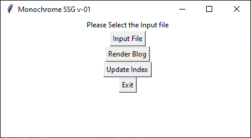

# Monochrome-SSG

## About

A custom-built `Python` Static Site-Generator(SSG) used to generate pages for my personal [website](https://www.abhe.in/) and [blog](https://www.abhe.in/blog/). It's used to fulfill the "back-end" needs of my website hosted here on GutHub Pages.

Called "Monochrome" because it was for being built for a website that was rendered using mostly black and white, and a hint of grey. However, before I could finish this script, I added a dark-mode that's got a lovely shade of [pink](https://www.color-hex.com/color/e62492) as the highlight colour.

The name stuck to the argument that the pink is the only "chrome" in the surrounding greyscale. Though it was mostly because I could not think of anything else.

View full notebook [here](https://www.abhe.in/monochrome-ssg/).

The code was inspired by [Jahongir Rahmonov's](https://rahmonov.me/posts/static-site-generator/) tutorial.

## Python Libraries Used

* `os`
* `datetime`
* `markdown2`
* `jinja2`
* `tkinter`

## Ugly GUI

The GUI currently looks like this:

## Future Work

* Add templates for non-blog pages.
* Add functionality to update templates.
* Add functionality to regenerate pages with new templates.
* Add functionality to import `.ipynb` HTML export.
